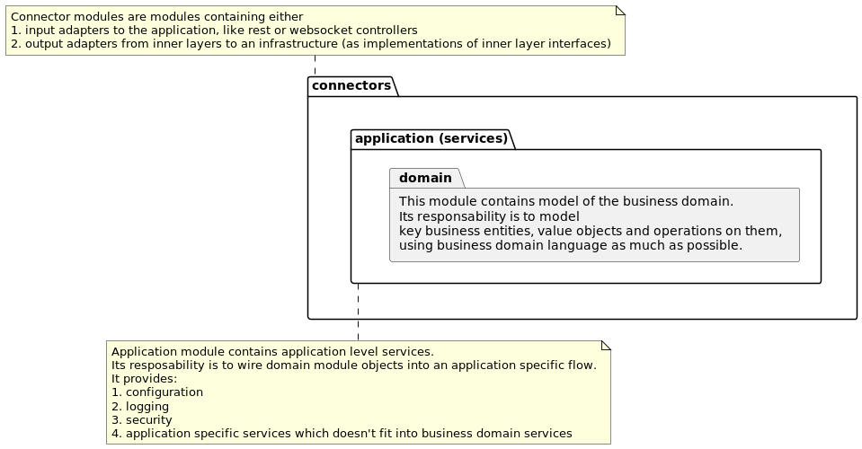

# DHC Synthesis SOW

## Usage guide

### Start application
Uvicorn process working dir should be app to allow pydantic to pick up application settings from app/settings.yml file:
```bash
cd app && fastapi run main.py
```

### Start application in dev mode
To watch and auto reload changes run following command:
```bash
cd app && fastapi dev main.py
```

## Developer Guide

### Architecture

#### Static organization
This part shows the project source code organization.

The root of the project organized in source code, test, documentation folders.
The root folder can contain other supporting files, like the ones for development or production environment setup.
```shell
dhc-synthesis/
├── alembic/                # Folder containing database migration files
├── app/                    # Folder containing application source code
├── doc/                    # Folder containing project documentation
├── docker-compose.yml
├── Dockerfile
├── notebooks/              # Folder containing useful and sharable jupyter notebook files
├── Pipfile                 # Project dependencies definition for pipenv tool
├── Pipfile.lock            # Project dependencies definition for pipenv tool
├── README.md
├── requirements.txt        # Project dependencies for pip tool
└── tests                   # Folder containing tests source code
```

The project source code is organized into top level packages that are split by functionality.
For general guide on Fastapi application source code organization see following [article](https://medium.com/@amirm.lavasani/how-to-structure-your-fastapi-projects-0219a6600a8f).
```shell
dhc-synthesis/app/
├── ...                     # root package containing main application files
├── ind/                    # ind package IND feature related application files
└── sow/                    # sow package SOW feature related application files
```
As a rule of thumb, code in any package can use code from packages on same level or higher packages.
For example, code in ind package can use code from sow or root packages, but root package code should not use code from idn or sow packages.

Static organization of source code in packages follows Domain Driven Design onion architecture:
For general guide on onion architecture and responsibilities of each onion layer see following [article](https://blog.itsjavi.com/target-software-architectures-the-onion-architecture).
```shell
dhc-synthesis/app/
├── cli.py                  # connector module containing cli adapter to the application
├── controller.py           # connector module containing HTTP REST adapter to the application
├── domain.py               # domain module containing core business domain classes and api
├── main.py                 # application module containing fastapi http server setup
├── rdbs.py                 # connector module containing relational database adapter for the application
├── service.py              # application module containing application level services adding extra logic or conditions specific to the use case.
├── settings.py             # application module providing configuration functionality
```

Diagram below depicts 3 key source code layers:
1. Domain
2. Application
3. Connectors



### Build
```shell
docker build -t dhc-synthesis .
```

### Run
```shell
docker run --rm -d -P --name dhc-synthesis dhc-synthesis
```
